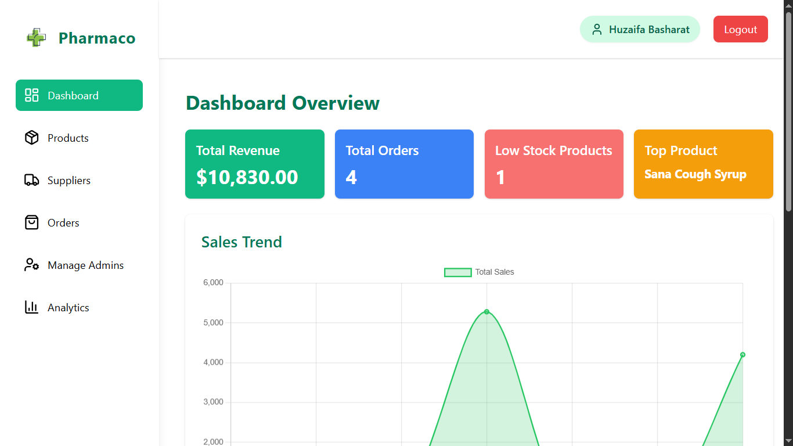
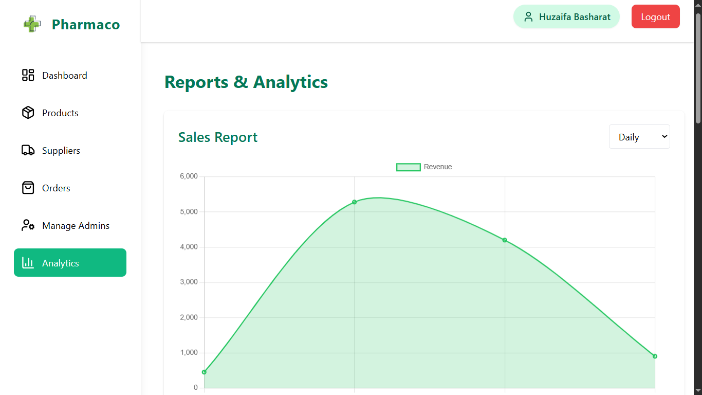
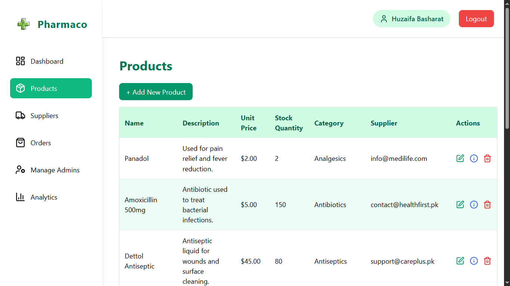

# 💊 Pharmacy Inventory Management Dashboard — ASP.NET Core MVC App

> A full-featured **Pharmacy Inventory Management System** built with **ASP.NET Core MVC** and **Razor Pages**, featuring real-time analytics, clean UI, and complete admin control over inventory, suppliers, and orders.

---

## 📌 Features

- 📦 Full **Product Management** (Create, Read, Update, Delete)
- 🚚 **Supplier Management** with contact details and history
- 🧾 **Order Management** including order details & history
- 📊 **Analytics Dashboard** with interactive graphs and charts
- 🔐 Secure configuration using environment variables
- 🎯 Developed with clean architecture and scalable code

---

## 🚀 Getting Started

### ✅ Prerequisites

- [.NET 6+ SDK](https://dotnet.microsoft.com/download)
- [SQL Server](https://www.microsoft.com/en-us/sql-server/sql-server-downloads)
- [Visual Studio 2022+](https://visualstudio.microsoft.com/)
- Git

---

### 🔧 How to Run Locally

1. **Clone the repository:**

   ```bash
   git clone https://github.com/huzaifa-190/Pharmaco_Inventory
   cd Pharmaco_Inventory/Inventory_Management_Dashboard/

2. **Create .env file inside the project folder and update this content:**

   ````bash
   LOCAL_SQL_CONNECTION_STRING = Server=<YOUR_MACHINE_NAME>;Database=inventoryDB;Trusted_Connection=True;TrustServerCertificate=True
   
3. **Apply database migrations (if not already applied):**

   ````bash   
   dotnet ef database update

4. **Run the application:**

   ````bash
   dotnet run

5. **Visit the app in your browser:**

   ````bash
   https://localhost:7185

---

## 🧠 Technologies Used

- **ASP.NET Core MVC** with Razor Pages  
- **Entity Framework Core**
- **SQL Server**  
- **Chart.js** for visual analytics  
- **Tailwind CSS** for UI
- **Visual Studio**  
- **C#**

---

## 📷 Screenshots

| Dashboard | Analytics | Product Management |
|----------|-----------|--------------------|
|  |  |  |


---

## 👤 Author

**Huzaifa Basharat**  
[LinkedIn](https://www.linkedin.com/in/huzaifa-basharat-941a01283/) • [GitHub](https://github.com/huzaifa-190) • [Portfolio](https://huzaifa-basharat.vercel.app/)

---


 
